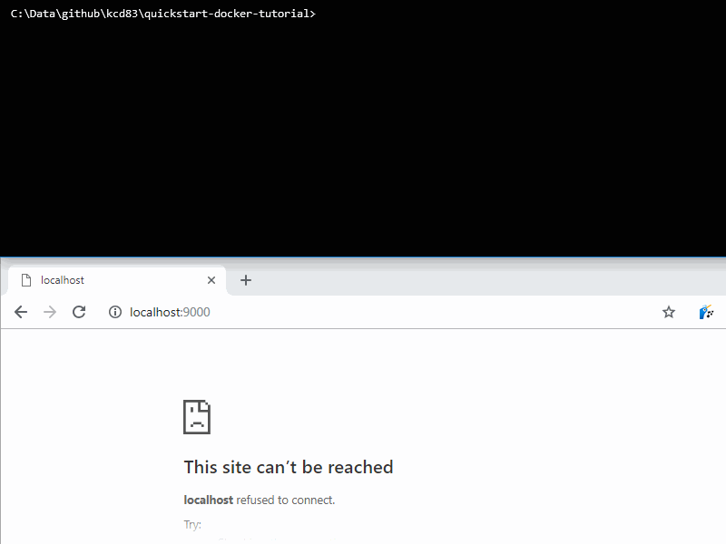

# Quickstart Docker tutorial

In this quick tutorial you will run simple Docker commands so you can get hands on with the fundamental concepts of containers. No prior knowledge is expected and even if you have already dabbled you should be able to skim through this in only a few minutes.



Docker provides very lightweight and portable virtual machines using a technology called "cgroups" (control groups) instead of a traditional hypervisor. Many of the benefits stem from not fully virtualising the whole hardware stack like a traditional virtual machine (VM) and instead Docker uses cgroups to isolate the container while sharing the same Linux kernel.

In this tutorial we focus on demonstrating the typical workflow, which is similar to compiling software locally and shipping the binaries except with Docker we package the whole machine. To update a running container we replace it with a newer version of the image. This is known as immutable infrastructure and it is easier to appreciate once you have seen it in action.

* [Run a container from an image](#run-a-container-from-an-image)
* [Interactive "login" into a container](#interactive-login-into-a-container)
* [Building and modifying a container](#building-and-modifying-a-container)

## Prerequisites

Install Docker CE Desktop from [docker.com/get-started](https://www.docker.com/get-started) and have a command line. If you are on Windows this will be PowerShell.

Docker for Windows requires HyperV and actually launches a Linux VM called Mobylinux for Linux containers. Ignore Windows containers, they are an advanced use case you don't need to know about yet. All your interactions with Docker are proxied to Mobylinux and this is helpful to understand if things go wrong. For example, Docker for Windows needs your current password to mount your local drives, more on that later.

Enough words, let's run something.

## Run a container from an image

In this section we learn how to run an existing container, when finished you should understand what the following command does:
`docker container run --rm -d --name myweb -p 9000:80 nginx`

Get the popular webserver nginx ("engine X"). This is the latest official image from: [hub.docker.com/_/nginx/](https://hub.docker.com/_/nginx/)

    docker image pull nginx

List all images.

    docker image list

Run a container instance of nginx and map a local port to port 80 (`-p` is `--publish`) then open it in your browser: [localhost:9000](http://localhost:9000)

    docker container run -p 9000:80 nginx

You might be prompted allow this through your local firewall, allow it. You should see access logs for `"GET / HTTP/1.1" 200` or the Not Modified status `304` when you refresh your browser.

Press `Ctrl+C` to detach. The container is still running in the background and you can see it with:

    docker container list

Note the quirky auto-generated name and id, either can be used to identify the container (tip: only enough of the id to be unique is required).

Using an identifier to show and follow the output, like before we detached.

    docker container logs --tail 1 --follow determined_darwin

Press `Ctrl+C` to detach. Stop the container with the same identifier or try using the id (I use `2e` which was short for `2e9d7ea7a1e9`).

    docker container kill 2e

Great, your browser should now show an error connecting when you refresh. However the container still exists when you also list stopped containers (`-a` is `--all`).

    docker container list
    docker container list -a

Now remove it.

    docker container rm determined_darwin

That was easy, but let's check help on the run command for how to reduce the number of steps.

    docker container run --help

```
Usage:  docker container run [OPTIONS] IMAGE [COMMAND] [ARG...]

Run a command in a new container

Options:
...
  -d, --detach                         Run container in background and
      --name string                    Assign a name to the container
  -p, --publish list                   Publish a container's port(s) to
      --rm                             Automatically remove the container
...
```

The following will start a container in the background with a known name and it deletes itself on termination.

    docker container run --rm -d --name myweb -p 9000:80 nginx

When we are done, use our name to stop and remove it.

    docker container stop myweb

You can find other images to run from a registry such as [Docker Hub](https://hub.docker.com/search?q=&type=image).

## Interactive "login" into a container

To debug or otherwise interact with a VM you would probably ssh into it, and similarly with a container it is useful to understand how to run an interactive shell. Specifically this section will show you how to use `-it` with `exec` or `run` for bash in either an existing or new container.

If it is not already running, start an nginx container.

    docker container run --rm -d --name myweb -p 9000:80 nginx

Execute the unix name utility inside the container, arguments can be sent too.

    docker container exec myweb uname
    docker container exec myweb uname --all

Execute a command that reads standard input (`-i` is `--interactive`) and counts words with "o" characters.

    echo hello world | docker container exec -i myweb grep -c o

Note if this does not return "2" it could be your console emulator, you can try another but it is not as important as the next combination.

Execute an interactive terminal (`-t` is `--tty`). Type `exit` to end the bash shell.

    docker container exec -i -t myweb bash
    ls -la
    cat /usr/share/nginx/html/index.html
    exit

Run a bash shell in a new container (`-it` is `--interactive` and `--tty`).

    docker container run --rm -it alpine sh
    ls -la
    exit

This will pull the alpine image if you don't already have it. This is a minimal image commonly used because of its small size (try listing images again to see the size). It does not contain `bash` which is why we use the simpler _bourne shell_ (`sh`).

Running a container interactively is normally useful for debugging images as you build them or to run command line tools.

## Building and modifying a container

To run a customised container it is normal practice to build your own image even for the smallest change. Let's explore editing files and packages inside an existing container before seeing how easy it is to build an image from a `Dockerfile`.

Try editing a file by appending a message to the default webpage of nginx to be visible at: http://localhost:9000

    docker container exec -i -t myweb bash
    cd /usr/share/nginx/html
    echo 'Hello' >> index.html
    exit

Or instead run do it in one line.

    docker container exec myweb bash -c 'echo Howdy >> /usr/share/nginx/html/index.html'

This change will show up in the browser, however it is normal practice to replace containers so spin up our container again.

    docker container kill myweb
    docker container run --rm -d --name myweb -p 9000:80 nginx

Now we have a new instance and our modification is lost, check your browser.

To build our own version we will add layers to nginx, create a `Dockerfile` containing:

```Dockerfile
FROM nginx

RUN echo "<p><i>Built at $(date)</i></p>" >> /usr/share/nginx/html/index.html
```

Build it with a custom name (`-t` is `--tag`, despite being "name and optionally a tag"). The trailing `.` is the path to the build context directory containing our file.

    docker image build -t helloworld .

List the images and you will see our image with the default tag of `latest`.

    docker image list helloworld

Note the fully qualified image naming scheme is `<[registry address]>/<[user or project]>/<image name>[:<tag>]`. This name excluding the tag is also called the _repository_.

    docker container stop myweb
    docker container run --rm -d --name myweb -p 9000:80 helloworld

In the browser you will see our build date time appended to the bottom.

To add our own web page create an `index.html` with HTML such as the following:

```html
<!DOCTYPE html>
<html>
<title>My Web</title>
<body>
    <h1>Hello World</h1>
</body>
</html>
```

Place that file beside our `Dockerfile` then copy it over the top of the default using the `COPY` line below:

```Dockerfile
FROM nginx

COPY index.html /usr/share/nginx/html/index.html

RUN echo "<p><i>Built at $(date)</i></p>" >> /usr/share/nginx/html/index.html
```

Build your image again, this time with a tag. List the your new image to see both all versions of your image.

    docker image build -t helloworld:2 .
    docker image list helloworld

Run it and in the browser you will now see your own webpage.

    docker container stop myweb
    docker container run --rm -d --name myweb -p 9000:80 helloworld:2

If you share your source files other people could build the same image but it is more common to publish the built image to a registry. The power of immutable infrastructure is to pull and run exactly the same version of a container anywhere.

## Summary of Docker commands

Congratulations you can build, run and interact with containers! There is plenty more to learn but hopefully this has demystified Docker and you now know where to start.

Below are commands and optional parameters used in this tutorial.

| Command       | Parameter | Description                                           |
| ------------- | --------- | ----------------------------------------------------- |
| `docker container list` | | List containers on your workstation, also `docker ps` |
|               | `-a`      | Include all (not just running containers)
| `docker container run <image>` | | Start a container from an image, also `docker run` |
|               | `-d`      | Detach and run in background |
|               | `--name <name>` | Assign a name to the container |
|               | `-p <port>:<port>`| Publish a container's port(s) |
|               | `--rm`    | Automatically remove the container when it stops |
|               | `-i`      | Interactive when running in the foreground (use with `-t`) |
|               | `-t`      | Allocate TeleTYpewriter to use the terminal (use with `-i`) |
| `docker container exec <container> <command>` | | Execute command inside a container, also `docker exec` |
|               | `-i`      | Interactive when running in the foreground (use with `-t`) |
|               | `-t`      | Allocate TeleTYpewriter to use the terminal (use with `-i`) |
| `docker container stop <container>` | | Stop a running container |
| `docker container rm <container>` | | Remove a container |
| `docker image pull <image>` | | Download image, defaults to `:latest` from Docker Hub, also `docker pull` |
| `docker image list` |     | List images on your workstation |
| `docker image build <path> ` | | Create an image with a context (e.g. `.`), also `docker build` |
|               | `-t`      | Name and optionally a tag for the image |
